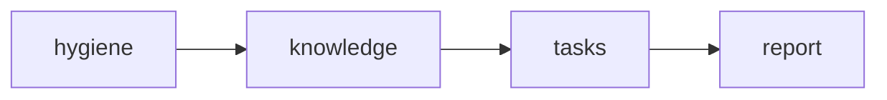
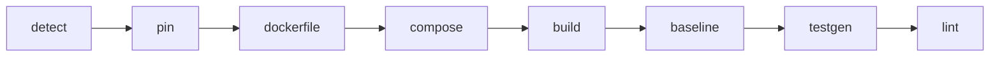
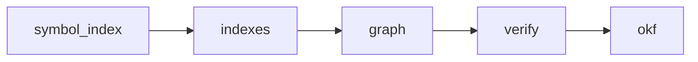
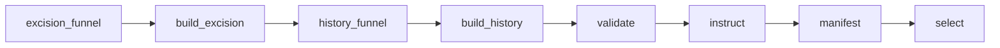

# Architecture

## Stage flow

The pipeline runs three stages in order: hygiene, knowledge, tasks. Each stage
is a sequence of named steps. The CLI dispatches them via `--stage` (default:
all three).



**Hygiene** — make the repo reproducible and testable:



**Knowledge** — build the machine-readable layer:



**Tasks** — mine, build, validate, and select the benchmark tasks:



After the tasks stage completes, the report builder aggregates all artifacts
into `output/<repo>/report_summary.json` and renders `output/<repo>/REPORT.md`.


## Resumability

Every step records its status, input hash, and completion timestamp in
`output/<repo>/state.json`. On a subsequent run, a step is skipped when its
inputs (source artifacts plus a fingerprint of the pipeline's own code) have
not changed. This means a code change to `pipeline/tasks/harness.py`
invalidates the task-stage steps but not hygiene or knowledge.

The code fingerprint is a SHA-256 over the pipeline source files listed in
`Config.hygiene_code_files`, `KnowledgeConfig.code_fingerprint_files`, and
`TasksConfig.code_fingerprint_files`. If any of those files changes, the
affected steps rerun.

Override controls:
- `--force STEP` reruns one specific step regardless of its hash.
- `--fresh` reruns everything from scratch.

Every LLM decision (commit classification, excision screen, OKF contracts,
instruction drafts) is also cached by content hash in
`output/<repo>/tasks/agent_cache/` or the step's own decisions file. A full
rerun on an unchanged repo costs zero LLM tokens.


## Run directory layout

All per-repo output lives under `output/<repo>/`:

```
output/<repo>/
  repo/                     # working clone with pipeline commits
  state.json                # resumability ledger
  report_data.json          # per-stage timing and usage
  hygiene/                  # step records (detect.json, pin.json, ...)
  knowledge/
    repo_graph.json         # static knowledge graph
    symbol_index.json       # raw AST index
    .okf/                   # OKF v0.2 knowledge bundle
    history_index.json      # per-commit touched functions
    test_map.json           # test nodeid -> source function map
    coverage.json           # per-function coverage percentages
    hotspots.json           # change frequency per function
    graph_verification.json
    okf_verification.json
  tasks/
    candidates.json         # excision funnel output
    history_candidates.json
    built.json, built_history.json
    instructions.json
    selection.json
    agent_cache/            # content-addressed LLM decision cache
  audit/
    llm_usage.json          # token usage by step
    agent_actions.jsonl     # every agent action (goal, files, outcome)
  report_summary.json       # aggregated data for REPORT.md
```

Task folders are written to `tasks/<repo>/<task_id>/` (separate from `output/`).
The root `tasks.json` contains the final selected set.


## Docker execution model

Every command against target-repo code runs inside a throwaway container:

```
docker run --rm --network none -v <fresh_workdir>:/repo -w /repo <image> bash -c "<cmd>"
```

One image per target repo, named `bench-<repo>`, built from a digest-pinned
`python:3.12-slim` base with `pip install --no-deps --require-hashes`. The
base digest is resolved at build time via `docker pull` and written into the
Dockerfile so builds are reproducible.

Fresh workdirs (a `shutil.copytree` per unit of work) ensure no shared state
between runs. Network is disabled for all test and verifier runs. Per-command
timeouts default to 900 seconds.

The same `run_in_container` helper (`pipeline/docker/runner.py`) is used by the
ecosystem adapter, the agent `run` tool, and the validation harness. Graders
can use the same image and the same `verifier/run.sh` command.

Images carry a `bench-pipeline=1` label. `--prune-images` removes only
untagged images with that label.


## Agent loop

The pipeline has its own agent loop (~120 lines, `pipeline/agent/loop.py`)
using OpenAI-compatible function calling. The loop ends when the model replies
with no tool calls or hits the turn cap. Tool errors are returned as text (no
crash). Tool results are truncated to `agent.max_tokens_per_tool_result`.

Two tool sets:

**Concrete tools** (used by repair, baseline-fix, test-gen, verifier agents):
`read_file`, `grep`, `write_file`, `run` (executes only inside the Docker
container). All paths are sandboxed to the workdir.

**Graph tools** (used by agents in the tasks stage): `show_symbol`, `callers`,
`callees`, `tests_for`, `show_commit` (backed by the repo graph, history
index, and git), and `okf` (reads from the `.okf/` bundle). These give the
agent structured access to the knowledge layer without raw file scanning.

Each agent run writes a full trajectory to `transcripts/agent/<step>/`.


## LLM client

`pipeline/llm/client.py` wraps an OpenAI-compatible endpoint (Baseten). Two
model tiers:

- **BIG**: `moonshotai/Kimi-K2.6` (thinking enabled). Used for authoring,
  coding, agents, and review.
- **SMALL**: `deepseek-ai/DeepSeek-V4-Flash-0731` (reasoning low). Used for
  classification and lookup.

Which tier a step uses is defined in `config.STEP_MODEL`. The reasoning
parameter is translated per model via `config.MODEL_CAPS` (Kimi uses
`enable_thinking`; DeepSeek uses `reasoning_effort`).

**Schema-forced JSON**: `complete_json()` forces a tool call matching a JSON
schema, validates client-side with `jsonschema`, retries on validation failure
(up to `max_schema_retries`), and falls back to parsing fenced JSON from the
text response. This handles endpoints that do not enforce tool schemas
server-side.

**Retries**: exponential backoff on API errors, up to `api_max_retries` (5).

**Usage accounting**: every call's token counts (prompt, completion, reasoning)
are tracked per step and written to `output/<repo>/audit/llm_usage.json`.
A per-repo budget (`llm.max_tokens_per_repo`, default 5M) aborts the run if
exceeded.

**Transcripts**: one JSON file per `LLMClient.chat()` call, saved to
`transcripts/pipeline/<stage>/`.

**Record/replay**: `LLM_MODE` controls the mode:
- `live` (default): real API calls.
- `record`: real API calls, responses saved as cassettes.
- `replay`: responses loaded from cassettes, no network.

Tests always run in replay mode against committed cassettes.


## Ecosystem adapter

All language-specific logic lives behind the `EcosystemAdapter` interface
(`pipeline/ecosystems/base.py`, ~11 methods). The `PythonAdapter`
(`pipeline/ecosystems/python.py`) is the only implementation.

The adapter handles: ecosystem detection, packaging info, requirements
synthesis, Dockerfile generation, test command and report parsing, lint
configuration, AST-based symbol indexing, and mutation operators.

Non-Python repos are detected and rejected with a clear message. Adding a
new language means implementing the adapter interface.


## Logging

Console output from `pipeline/log.py`: `HH:MM:SS [stage/step] msg`, one
line per event. Every step prints `start`, then either
`done in <s> (<n> LLM tokens)` or `skipped (unchanged)`. Inner events (build
repair attempts, per-module test-gen, per-task validation verdicts, selection)
print between them.

The run ends with a `[summary]` block: per-stage step durations, tokens by
model tier, VALID count, and the selected task IDs.

`--quiet` keeps only stage boundaries and the summary.
